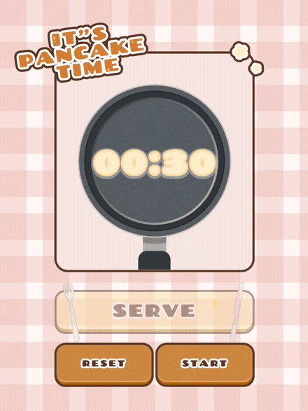

# It's Pancake Time

A timer seen from directly above a frying pan. **The countdown digits are the batter**: raw when you start, perfectly golden at 00:00, and burnt if you leave them.

▶︎ **[Open the timer](https://olliedesign00-dotcom.github.io/pancake-timer/)**



## How to use it

1. **Drag the pan's handle** around the rim to set the time, from 00:30 to 15:00 (or focus it and use the arrow keys)
2. Press **START**. The batter colours as time passes and the bubbles grow and drift
3. Press **SERVE** within 2.5 seconds either side of 00:00. Land it and a sunburst rotates behind the plate
4. Too early and it is still raw; too late and it is burnt

## Layout

```
index.html              the timer itself (generated, not edited by hand)
build.sh                rebuild it
src/
  build_app.py          assembles the page, inlines decorations and the favicon
  add_sfx.py            embeds the five sounds and wires up playback
  add_glow.py           the successful-serve sunburst and the burn rate
  add_texture.py        grain on the title and the stars
  _style.txt _script.txt           the CSS and JS
  _head.txt _defs.txt _serve.txt   page head, shared SVG defs, SERVE button
  assets/  sfx/         source assets (sfx/original/ holds the uncompressed audio)
media/                  demo video
```

## Building

```bash
./build.sh
```

Requires Python 3 and Pillow. The four steps rewrite the same file in turn, so **the order matters**. Every asset (audio, favicon, decorations) is inlined as a data URI, and the result is a single HTML file you can open directly.

## Credits

Sounds are in `src/sfx/`. Type is Chango and Nunito from Google Fonts. The favicon and the design are the author's own work.
